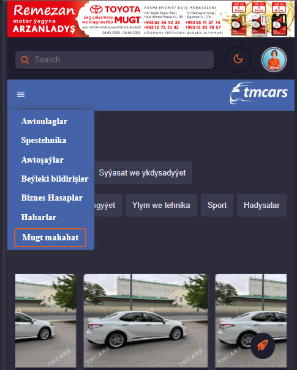
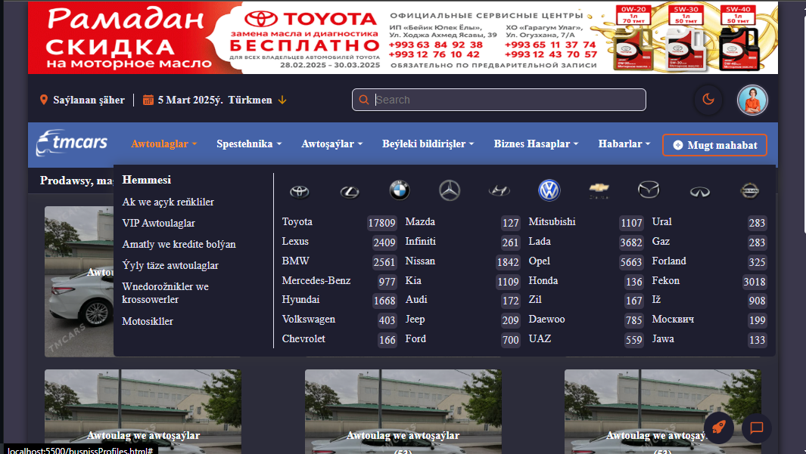
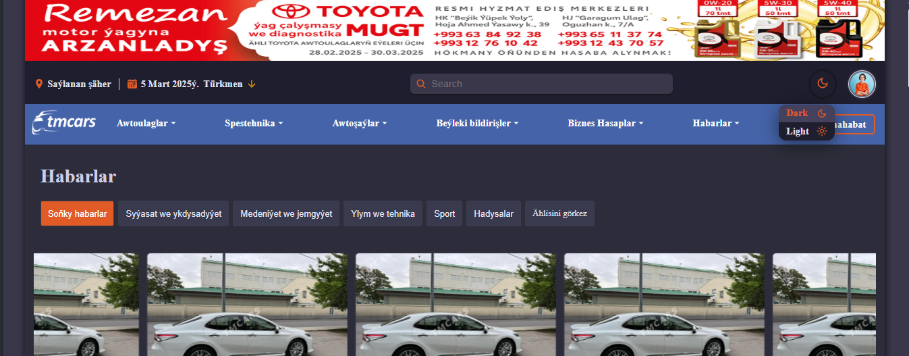
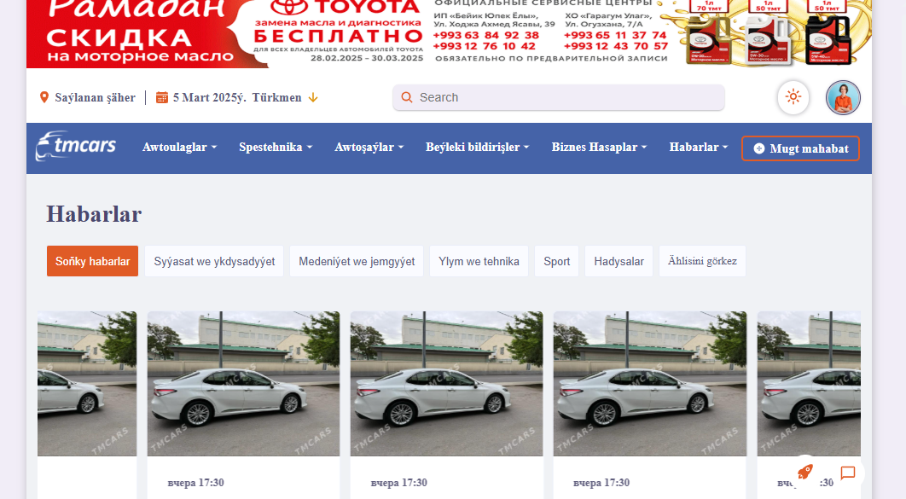
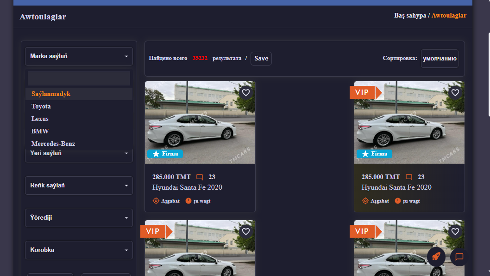
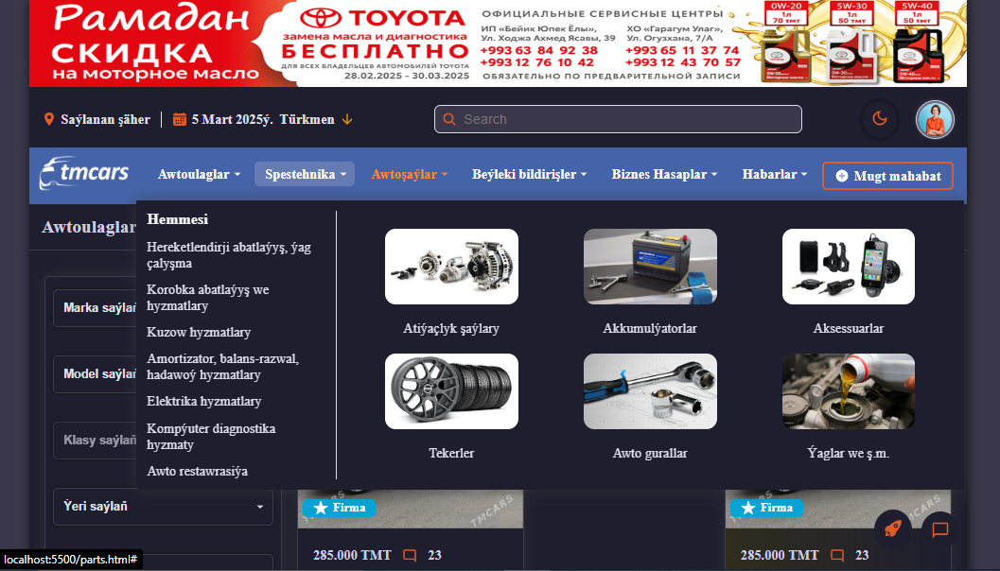
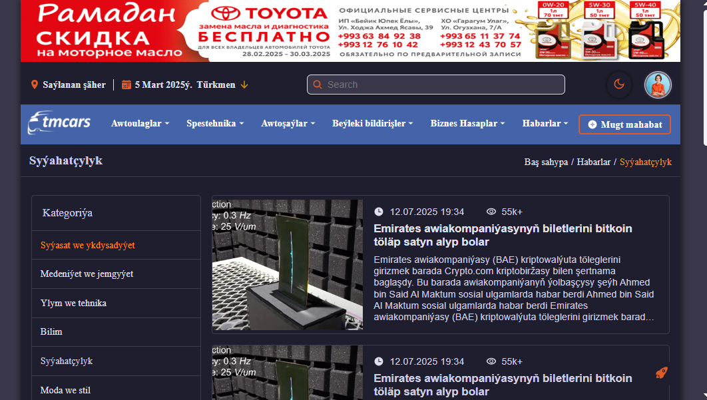
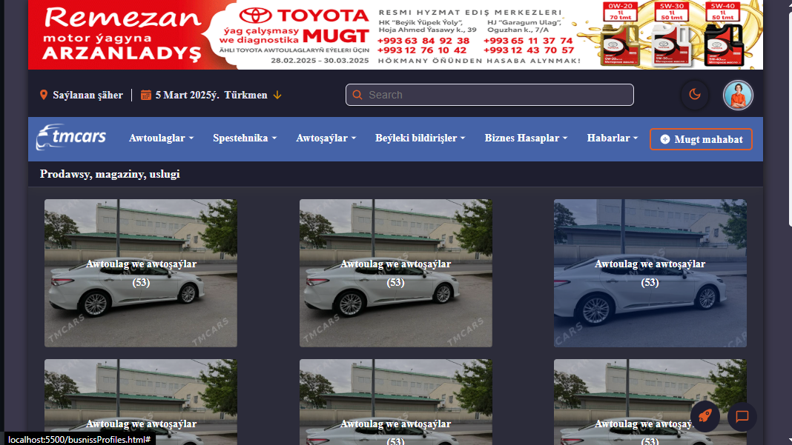
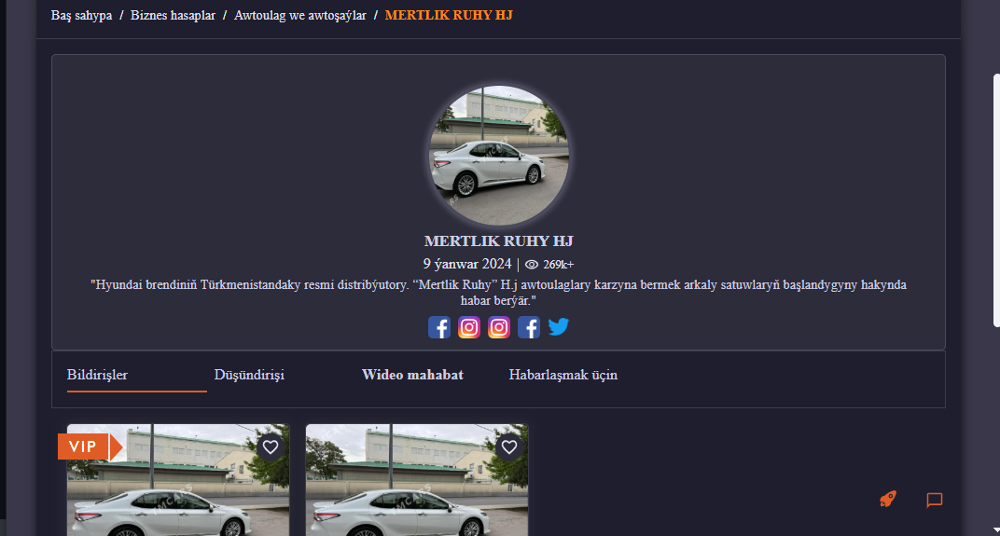
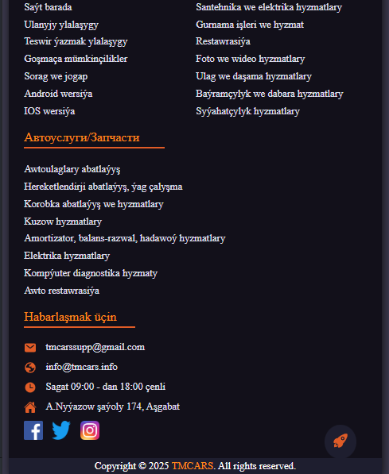

# This project was implemented using only HTML, CSS and JS.

* The pages were developed with a responsive framework. The responsive framework has mobile, tablet and desktop views.
* It has light and dark themes.
* A mega header menu was used when using tablets and desktops.
* Search input, language and location support were added to the header

---

---

---

---

## Home page:

**This page features:**

* *posts card animation*
* *car cards*
* *business profile cards*
* *mini posts cards.*

## Cars page:

**This page features:**

* *to filter cars by price, year*
* *to filter make, model, and class v.s.*

  ***This features also available on other pages. Others page and parts page.***

---

## Parts page

## Posts page

## Business profiles page

## Business profile information page

#### Footer

